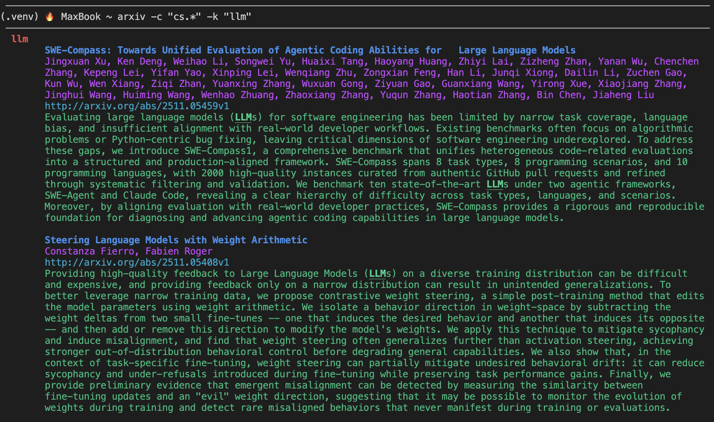

# Live arXiv Paper Filter

This is a command-line tool to fetch and filter the latest papers directly from the arXiv API, providing up-to-the-minute results in your terminal.

This version is a complete, API-driven tool that offers significant enhancements for a streamlined workflow:
1.  **Live API Fetching:** The primary method fetches data directly from the official arXiv API, ensuring you get the latest papers the moment they are available.
2.  **Smart Default Categories:** By default, the tool automatically searches within the core AI/ML categories (`cs.LG`, `cs.CL`, `cs.CV`, `cs.AI`, `cs.IR`).
3.  **Interactive Arguments:** Use command-line flags to search for keywords, authors, and to override the default categories on the fly. Includes a precise "whole-word" search option for acronyms.
4.  **Powerful Terminal Command:** A simple Zsh function (`arxiv`) provides a seamless interface to the tool.
5.  **Optional Email/File Parsing:** For offline use, a secondary script and workflow are provided, based on the logic from a separate open-source project.

_Example of the terminal output after running the filter for "LLM", with custom colors._


## Table of Contents

- [Prerequisites](#prerequisites)
- [Installation and Setup (Primary Workflow)](#installation-and-setup-primary-workflow)
- [Usage of the Main `arxiv` Command](#usage-of-the-main-arxiv-command)
- [Optional Workflow: Parsing Local Emails (macOS)](#optional-workflow-parsing-local-emails-macos)
- [Key Files](#key-files)
- [Contributing](#contributing)
- [Disclaimer](#disclaimer)

## Prerequisites

- **Python 3** installed.
- For the optional email workflow on Mac: The native **Apple Mail** app.

## Installation and Setup (Primary Workflow)

This setup is for the main, API-driven tool.

### Step 1: Clone the Repository

```bash
git clone <repository_url>
cd <repository_folder_name>
```

### Step 2: Set Up Python Environment

```bash
# Create a virtual environment
python3 -m venv .venv

# Activate it
source .venv/bin/activate

# Install the required packages
pip install -r requirements.txt
```

> ⚡ **Pro Tip: Faster Installation with `uv`**
> For a significantly faster installation, you can use `uv`, a next-generation Python package installer. First, install it (`pip install uv`), then use `uv pip install -r requirements.txt`.

### Step 3: Create the Terminal Command (Zsh Function)

This function will create the main `arxiv` command in your terminal.

1.  Open your Zsh configuration file:
    ```bash
    open ~/.zshrc
    ```
2.  Add the following function to the end of the file. **Remember to replace `/path/to/your/ArXiv-Reader` with your actual project path.**

    ```bash
    # Function to fetch live data from arXiv API and filter it
    arxiv() {
      # Activate venv and run the CLI script, passing all arguments
      source /path/to/your/ArXiv-Reader/.venv/bin/activate
      python /path/to/your/ArXiv-Reader/arxiv_cli.py "$@"
    }
    ```
3.  Save the `.zshrc` file and reload your terminal session:
    ```bash
    source ~/.zshrc
    ```

## Usage of the Main `arxiv` Command

The `arxiv` command fetches and filters the latest papers directly from the arXiv API. By default, it searches the latest papers in the core AI categories: **Machine Learning (`cs.LG`), Computation and Language (`cs.CL`), Computer Vision (`cs.CV`), Artificial Intelligence (`cs.AI`), and Information Retrieval (`cs.IR`).**

### Advanced Search (using command-line arguments)

**Filter by Keyword(s):**
```bash
# Find papers with the phrase "large language models" in the default categories
arxiv -k "large language models"

# Use -w for a precise, whole-word search (perfect for acronyms)
arxiv -k "RAG" -w
```

**Filter by Author(s):**
```bash
# Find papers by "Yann LeCun" in the default categories
arxiv -a "Yann LeCun"
```

**Override the Default Categories:**
Use the `-c` flag to search within specific CS sub-fields instead of the default list.
```bash
# Search for "transformer" only in Robotics (cs.RO)
arxiv -c cs.RO -k "transformer"

# Search across all of Computer Science
arxiv -c cs.* -k "attention"
```

**Control the Number of Results:**
The `--max` flag controls how many of the latest papers to fetch (default is 2000).
```bash
# Search for "GAN" within the latest 50 papers from cs.CV
arxiv -c cs.CV --max 50 -k "GAN" -w
```

## Optional Workflow: Parsing Local Emails (macOS)

This secondary workflow is for users who prefer to automate fetching from their local Apple Mail app instead of the live API.

> **Citation:** This local email parsing workflow is based on the original work by **ege-erdogan**. The original repository can be found at: [https://github.com/ege-erdogan/yet-another-arxiv-filter](https://github.com/ege-erdogan/yet-another-arxiv-filter).

### Step 1: Subscribe to arXiv Daily Emails

First, ensure you are receiving the daily arXiv emails by sending a **plain text** email:

- **To:** `cs@arXiv.org`
- **Subject:** `subscribe <Your Full Name>`
- **Body:** Add subject classes, one per line (e.g., `add Machine Learning`).

```bash
add Machine Learning
add Computation and Language
add Computer Vision and Pattern Recognition
add Artificial Intelligence
add Information Retrieval
```
> You can find the full subscription information [https://info.arxiv.org/help/subscribe.html][here]


### Step 2: Create the Email Fetch Script (AppleScript)

This script tells your Mail app to save the latest arXiv email to a file.

1.  Open the **Script Editor** app on your Mac.
2.  Paste the following code, **editing the `outputPath`** to point to a `mail_text.txt` file inside your project folder.

    ```applescript
    -- This path is personalized for your setup.
    set outputPath to "/path/to/your/ArXiv-Reader/mail_text.txt"

    -- Tell the Mail application to do the following:
    tell application "Mail"
        -- Search for messages from "noreply@arxiv.org" with "cs daily" in the subject
        set theMessages to (messages of inbox whose sender is "noreply@arxiv.org" and subject contains "cs daily")
        
        -- Check if any messages were found
        if (count of theMessages) is 0 then
            return "No new arXiv email found."
        end if
        
        -- Get the very last message in the list (the most recent one)
        set theMessage to the last item of theMessages
        
        -- Get the plain text content of that message
        set theContent to the content of theMessage
        
        -- Write the content to the output file
        try
            set theFile to open for access file outputPath with write permission
            set eof of theFile to 0 -- This clears the file before writing
            write theContent to theFile starting at eof
            close access theFile
            return "Successfully saved arXiv email to mail_text.txt"
        on error
            close access file outputPath
            return "Error writing to file."
        end try
    end tell
    ```
3.  Save the script inside your project folder as `fetch_arxiv.scpt`.

### Step 3: Create the Email Terminal Command

1.  Open your Zsh configuration file (`open ~/.zshrc`).
2.  Add this second function to the end of the file, again **replacing the paths with your own**.

    ```bash
    # Optional function to parse the latest email from the Apple Mail app
    arxiv_mail() {
      source /path/to/your/ArXiv-Reader/.venv/bin/activate
      cd /path/to/your/ArXiv-Reader
      # Fetch the email first
      osascript fetch_arxiv.scpt >/dev/null 2>&1
      # Then parse the resulting file, passing along all arguments
      python arxiv_filter.py "$@"
    }
    ```
3.  Reload your terminal: `source ~/.zshrc`.

### Step 4: Usage of `arxiv_mail` Command

This command requires you to provide arguments.
```bash
# Search for a keyword in your latest email
arxiv_mail -k "transformer"

# Search for an author in your latest email
arxiv_mail -a "Geoffrey Hinton"
```

## Key Files

-   **`arxiv_cli.py`**: The **main, primary** tool that fetches live data from the arXiv API.
-   **`util.py`**: A helper script for styling the terminal output.
-   **`requirements.txt`**: Lists all necessary Python packages for the project.
-   **`keywords.txt` / `authors.txt`**: Your default search terms for the `arxiv` command when run without arguments.
-   **`arxiv_parser.py`**: A **secondary, optional** script for parsing local text files.

## Contributing

Any feedback is welcome.

## Disclaimer

The author(s) of this repository are not responsible for any potential loss of career opportunities due to missed arXiv papers. Use at your own risk.